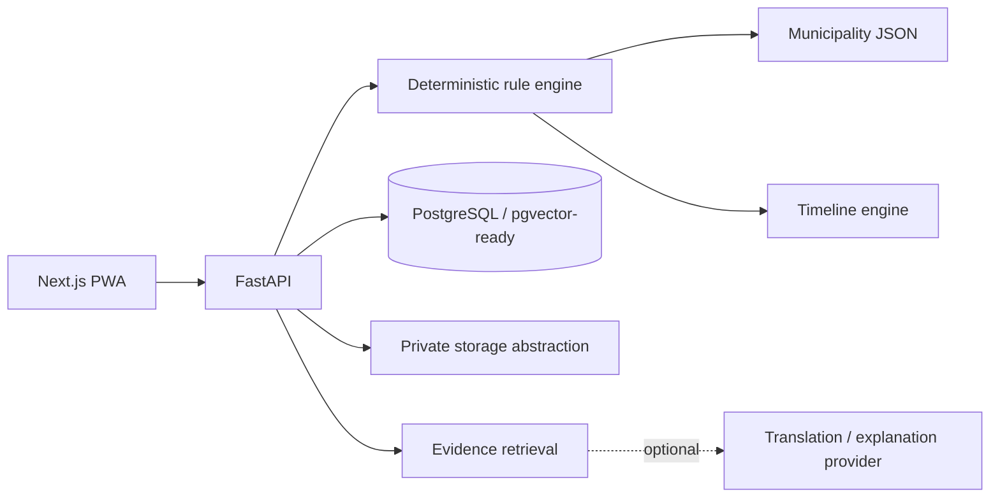
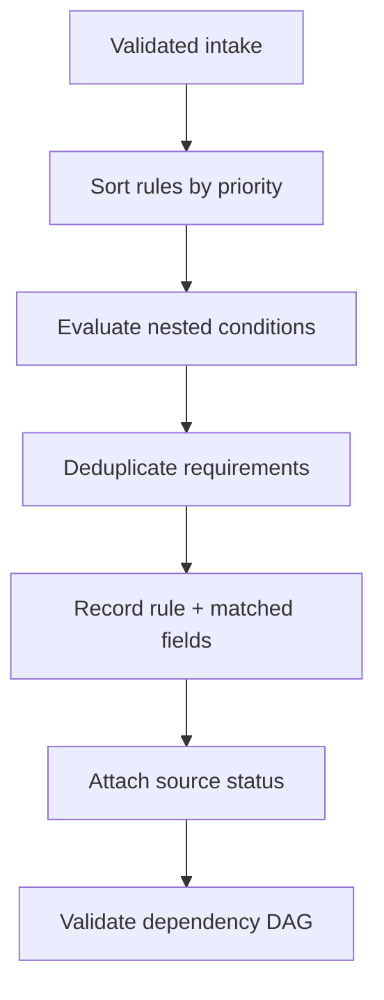
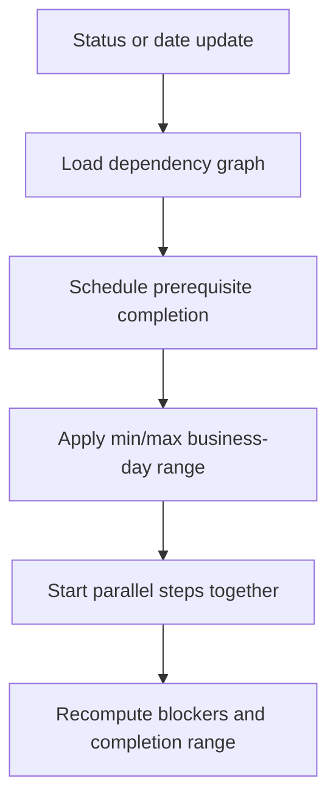
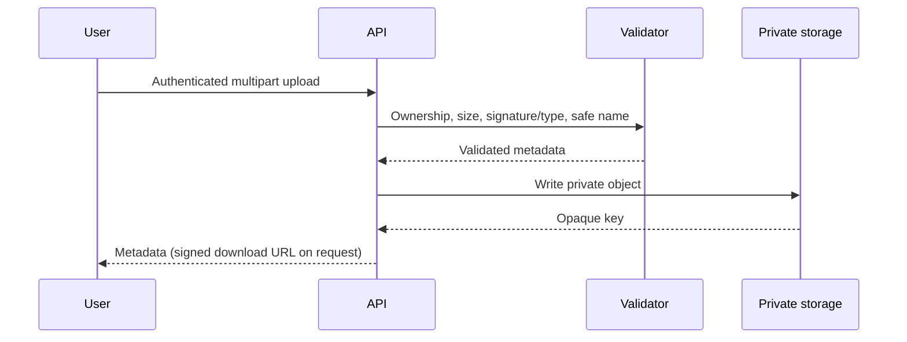

# PermitPilot

PermitPilot is a mobile-first civic workflow application that turns configured municipal permit rules into an interactive, timeline-driven roadmap. This repository contains a production-oriented MVP foundation with a polished no-login demonstration flow, a deterministic FastAPI rules/timeline service, multilingual UI, private-document safeguards, PWA support, and test coverage.

> **Important:** The bundled “Demo Harbor, MA” municipality is fictional. Every included rule, requirement, contact, source, document, and timeline is demonstration data—not official guidance or a legal determination.

## Why PermitPilot

Municipal procedures are commonly split among departmental pages, forms, and PDFs. People can often find an individual application but cannot see prerequisites, parallel reviews, missing documents, expected planning ranges, or the next useful action. PermitPilot presents that work as one traceable project.

The application deliberately separates legal workflow selection from AI. A deterministic, versionable rules engine selects requirements, records an evaluation trace, builds dependencies, rejects cycles, and schedules ranges in business days. A future AI provider may translate or explain retrieved verified passages, but it cannot add/remove requirements, change fees or deadlines, or override dependencies.

## What works

- Responsive landing page, three-step conditional intake with local autosave, and anonymous demo access
- Three complete demonstration workflows: home food business, room addition, and community event
- Persistent browser demo projects, milestone status changes, completion/blocker calculation, and document organization
- Checklist and responsive timeline views with sequential and parallel dependencies
- Citation drawer with evidence status and explicit confirmation warnings
- English/Spanish navigation, statuses, notices, and source framing without changing project state
- Offline application shell, cached routes, reconnect indicator, manifest, and installable PWA icon
- FastAPI endpoints for project creation/evaluation, timeline recalculation, status history, documents, sources, retrieval refusal, notifications, and health
- File-size, file-type, and filename validation; private-storage metadata; explicit malware-scanning placeholder
- Nested deterministic rule groups (`all`, `any`, `none`) and all requested comparison operators
- Circular dependency checks, business-day calculations, parallel scheduling, and automated API/engine tests

## Architecture









## Repository structure

```text
apps/web/                 Next.js App Router PWA
  app/                    Landing, intake, demo, project dashboard, methodology
  messages/               Structured English and Spanish translations
  lib/                    Typed demo project and persistence logic
apps/api/                 FastAPI service
  app/data/               Municipality rules, sources, and requirements
  app/rule_engine/        Deterministic evaluation and trace generation
  app/timeline_engine/    Business-day dependency scheduling
  tests/                  Engine and API integration tests
docs/                     Authoring, security, and architecture guidance
```

## Run locally

Prerequisites: Node.js 20+ and Python 3.12+.

```bash
cp .env.example .env
npm install
npm --prefix apps/web install
python3 -m venv apps/api/.venv
apps/api/.venv/bin/pip install -r apps/api/requirements.txt
npm run dev
```

Open `http://localhost:3000`. FastAPI docs are at `http://localhost:8000/docs`.

Verification:

```bash
npm run typecheck
npm run lint
npm run test
npm run build
```

## Configuration and authoring

Copy `.env.example` and set the anchor municipality values. The current API loads `apps/api/app/data/municipality.json`; municipality-specific facts never live in UI components.

- Add or revise deterministic selection in `apps/api/app/data/rules.json`. Conditions may use `equals`, `not_equals`, `in`, `not_in`, comparisons, `contains`, and `exists`, nested within `all`, `any`, or `none`.
- Define requirements, dependencies, configured min/max durations, documents, and source IDs in `apps/api/app/data/requirements.json`.
- Add source metadata in `apps/api/app/data/sources.json`. Never invent an excerpt, section, page, or URL. Use `needs_review` and leave unsupported fields null when verified evidence is unavailable.
- Add a language by copying `apps/web/messages/en.json`, translating values rather than keys, adding it to the language selector, and testing state persistence while switching.
- Notification delivery is currently in-app demonstration infrastructure. Email and SMS should be added behind provider interfaces; browser permission must only be requested after a user enables reminders.

## Data, storage, and security

`docker-compose.yml` supplies PostgreSQL with pgvector for deployment work. The MVP API currently uses an explicit in-memory repository so it starts without infrastructure; restart clears API projects. The browser demo persists project metadata locally. Before handling real user data, connect the repository interface to PostgreSQL/Alembic and configure authenticated storage.

Production uploads must remain private and be returned through short-lived signed URLs. The API currently enforces ownership at the project lookup boundary, a 10 MB limit, an allowlist of PDF/PNG/JPEG/WebP types, and sanitized basenames. Full byte-signature inspection, durable object writes, antivirus scanning, Supabase Auth, rate limiting, soft-deletion jobs, and storage cleanup are documented extension points and are not claimed as complete.

## Timeline estimates and sources

The configuration estimator returns min/max planning ranges. The timeline engine schedules prerequisites first, starts independent branches together, uses weekdays, and projects the final range from the dependency graph. These are never labeled as guaranteed or real-time municipal data.

All bundled citations have `demo` status and deliberately contain no invented quotation or official URL. The keyword retrieval endpoint refuses to answer when verified evidence is insufficient. A pgvector-backed retriever can later implement the same evidence-result interface without changing rule evaluation.

## Current limitations and next steps

This repository is an honest MVP foundation, not a live municipal service. Highest-priority production work is: load verified anchor-municipality sources and obtain municipal review; add Supabase/PostgreSQL persistence and Alembic migrations; implement Supabase Auth and row-level ownership; connect private object storage with signed URLs and malware scanning; expand status-transition policy and audit records; add full React Flow graph and Playwright browser coverage; introduce background reminder delivery; and perform a formal WCAG audit and threat model.

No AI key is required. If an AI explainer is later added, it must answer only from retrieved verified passages and retain the existing insufficient-evidence refusal.
